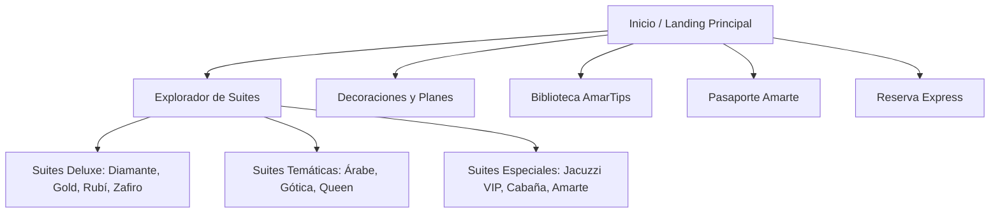

# 🪐 04_InformationArchitecture.md — Arquitectura de Información (Information Architecture)
## Proyecto: AMARTE Web Experience 2026
**Rol de Autor:** Arquitecto Principal del Proyecto

---

## 1. Estructura y Mapa del Sitio (Sitemap)
La estructura jerárquica de la aplicación web está optimizada para guiar al usuario hacia la conversión (reserva o inicio de chat con Martina):

---

## 2. Niveles de Navegación y Menú
* **Menú Principal (Header - Mobile Colapsable):**
  * **Explorar Suites** (Acceso rápido al catálogo completo).
  * **Planes Románticos** (Decoraciones especiales).
  * **AmarTips** (Consejos y contenido de valor).
  * **Pasaporte Digital** (Fidelización de clientes).
  * **Botón de Conversión Destacado:** "Reservar / Despegar" (Color Magenta Digital).
* **Navegación Flotante (Siempre Visible en Mobile):**
  * Icono de **Martina (Chat/Voz)** en la esquina inferior derecha.
  * Botón directo a **WhatsApp** en la esquina inferior izquierda (con margen adecuado para no solaparse con Martina).

---

## 3. Taxonomía de Contenidos

### 3.1. Fichas de Suites (Estructura de Datos)
* **Atributos de Identificación:** ID, Nombre, Categoría (Deluxe, Temática, Especial).
* **Especificaciones Físicas:** Capacidad, Jacuzzi (Sí/No), Sauna (Sí/No), Aire Acondicionado (Sí/No).
* **Precios por Rango de Tiempo (Matriz Oficial):** 4h, 8h, 12h, Día Hotelero (Domingo-Jueves / Viernes-Sábado).
* **Multimedia:** Galería de imágenes (4K, optimizada), Video de recorrido 360, Imagen de ambientación nocturna.
* **Extras Recomendados:** Enlaces directos a Planes compatibles (ej. Plan Erótico compatible con Suite Gótica).

### 3.2. Planes de Decoración (Estructura de Datos)
* **Atributos:** ID, Nombre del Plan, Descripción corta, Lista detallada de elementos incluidos.
* **Tarifas de Decoración:** Precio total con suite incluida (6h, 12h, Día Hotelero - Domingo-Jueves / Viernes-Sábado).

### 3.3. AmarTips (Estructura de Datos)
* **Atributos:** ID, Título, Contenido (texto), Categoría (Romance, Parejas, Sorpresas), Emojis asociados, Tags SEO.
