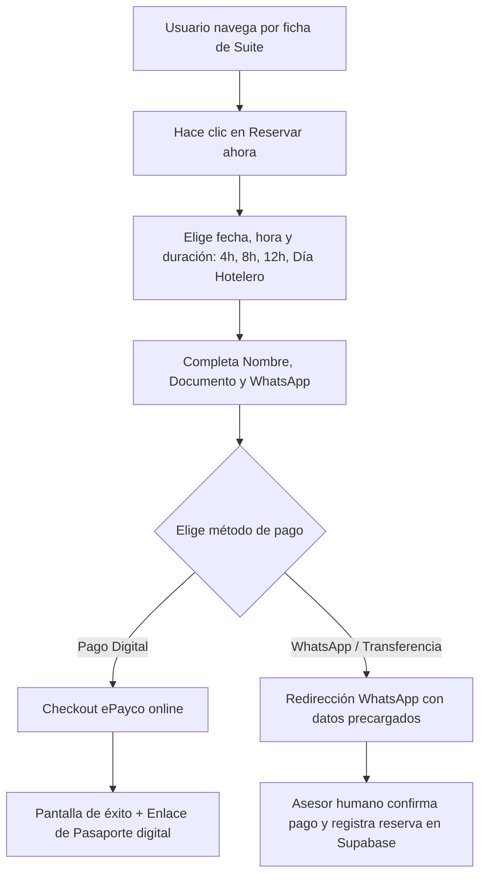
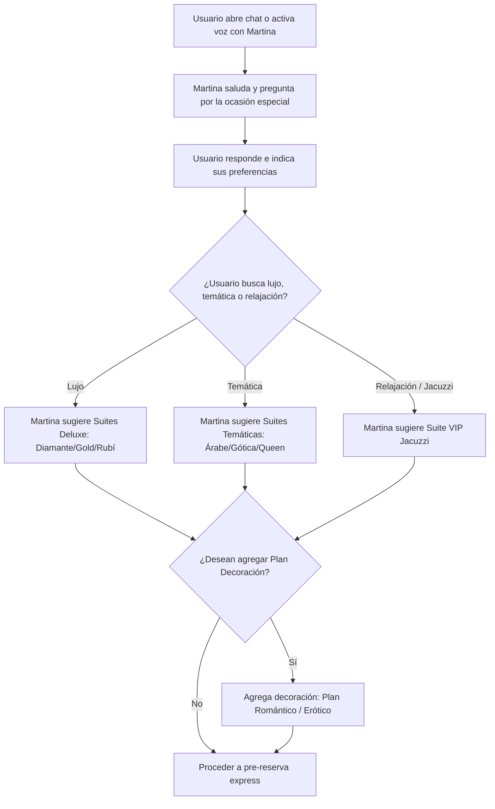

# 🪐 05_UserFlows.md — Flujos de Usuario (User Flows)
## Proyecto: AMARTE Web Experience 2026
**Rol de Autor:** Arquitecto Principal del Proyecto

---

## 1. Flujo de Pre-Reserva Express (Cierre Web/WhatsApp)
Muestra la ruta crítica desde que un usuario selecciona una suite hasta que realiza el pago o finaliza la reserva:

---

## 2. Flujo Conversacional con Martina
Describe cómo Martina interactúa con el usuario para resolver dudas y generar oportunidades de reserva (Upselling):

---

## 3. Flujo del Pasaporte Romántico (Fidelización)
1. **Acceso:** El cliente escanea un código QR en la suite física o ingresa a la web con su número de identificación.
2. **Visualización:** El panel muestra los sellos virtuales acumulados (cada suite visitada desbloquea un planeta diferente del sistema solar Amarte).
3. **Redención:** Al acumular 5 sellos, el sistema genera automáticamente un cupón digital con un código único de descuento para su próxima visita, canjeable directamente en el flujo de pre-reserva express o presentándolo al asesor por WhatsApp.
