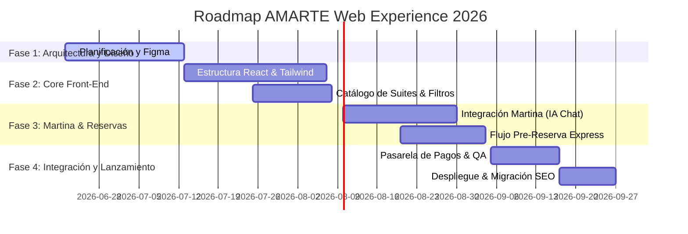

# 🪐 12_ProjectRoadmap.md — Hoja de Ruta del Proyecto (Project Roadmap)
## Proyecto: AMARTE Web Experience 2026
**Rol de Autor:** Arquitecto Principal del Proyecto

---

## 1. Hitos y Fases de Desarrollo
El proyecto se dividirá en 4 fases incrementales para asegurar una entrega de valor temprana, mitigando riesgos operativos y garantizando la coherencia de marca:

---

## 2. Detalle de Entregables por Fase

### Fase 1: Arquitectura, Diseño y Definición (Mes 1)
* **Objetivo:** Alinear la visión del producto y consolidar la UI/UX antes de iniciar el código.
* **Entregables Clave:**
  * Documentación estratégica de arquitectura (17 entregables de esta fase).
  * Prototipos interactivos de alta fidelidad en Figma (Móvil y Escritorio).
  * Definición final del prompt de sistema de Martina y modelo de IA.

### Fase 2: Core Front-End y Catálogo (Mes 2)
* **Objetivo:** Construir el catálogo digital de suites, componentes reutilizables y la landing page.
* **Entregables Clave:**
  * Estructura base del repositorio con React y Tailwind.
  * Catálogo interactivo de Suites y Filtros rápidos (Mobile-First).
  * Landing page premium optimizada para Core Web Vitals.

### Fase 3: Martina Conversacional y Flujo de Reserva (Mes 3)
* **Objetivo:** Integrar a Martina como anfitriona interactiva y habilitar el sistema de pre-reserva express.
* **Entregables Clave:**
  * Widget de Chat de Martina integrado con API de LLM.
  * Flujo de pre-reserva express con cálculo automático de tarifas.
  * Conector a WhatsApp con empaquetado de datos de reserva.

### Fase 4: Checkout, Integraciones y Lanzamiento (Mes 4)
* **Objetivo:** Habilitar los pagos online, sincronizar con el panel de administración/portería de Supabase y desplegar.
* **Entregables Clave:**
  * Integración con la pasarela de pagos ePayco.
  * Conexión en tiempo real con el sistema interno de portería preexistente.
  * Configuración de redirecciones SEO 301 y lanzamiento público a producción.
