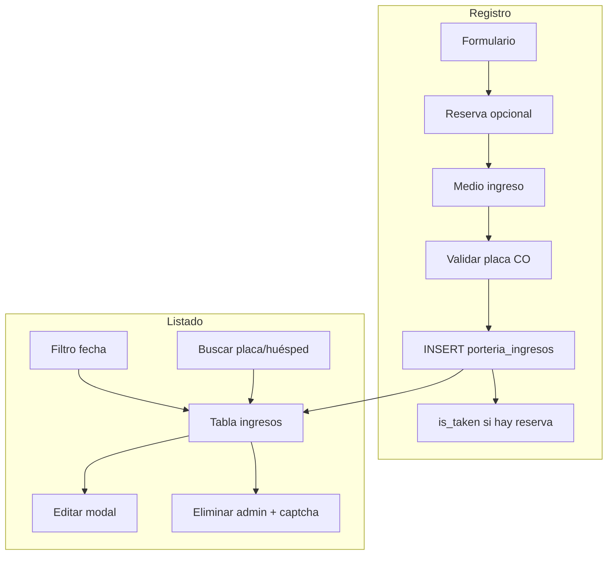

# Dossier técnico – Reservas Amarte Suite

**Fecha de actualización:** 12 de junio de 2026 (mantenimiento dependencias, tests checkout, docs)  
**Proyecto:** Sistema de gestión operativa para Hotel Amarte Suite  
**Metodología:** Análisis siguiendo `.cursorrules` (Plan-First, Verify-Always, tareas en `tasks/todo.md`).

---

## 1. Resumen ejecutivo

Aplicación web para la operación diaria del Hotel Amarte Suite:

- **Reservas:** CRUD sobre Postgres (`reservations`), paginación server-side, búsqueda, exportación, detección de solapamientos, auditoría de cambios.
- **Calendario y precios:** visualización y consulta de tarifas desde tablas de habitaciones/tarifas.
- **Pasaportes:** gestión de sellos/pasaportes de clientes.
- **Ingreso Portería:** registro de llegadas (medio de transporte, placa, novedad, datos de conductor taxi/uber), listado filtrable y edición posterior.
- **Administración:** usuarios (roles), asesores, pagos pasarela, dashboard.

**Stack:** React 18 + TypeScript + Vite 8, Tailwind CSS 3, Supabase (Auth, Postgres, Edge Functions, Realtime).  
**Autenticación:** email vía Supabase Auth; Google OAuth con sesión en Edge Function (`POST /auth/session`).  
**Roles:** `admin`, `user`, `asesor`, `portero` — control de rutas y menú en frontend (`rolePermissions.ts` + `App.tsx`).  
**Calidad:** ESLint sin errores, TypeScript strict, Vitest (**76 tests** en 11 archivos), CI en GitHub Actions con `npm audit --audit-level=high` (0 vulnerabilidades high/critical al 12/06/2026).

El flujo principal de reservas es **100% Postgres** (`sheetsService.ts`). La Edge Function mantiene endpoints opcionales hacia Google Sheets (legacy); el frontend no los usa en el flujo habitual.

**Enlace público de reservas:** `https://amartesuite.com/formulario-reservas-amarte-suite/` (desde menú lateral en `App.tsx`).

---

## 2. Estructura del proyecto

```
reservasAmarteSuite/
├── .cursorrules
├── .github/workflows/ci.yml       # lint, typecheck, test, build, npm audit
├── tasks/
│   ├── todo.md
│   └── lessons.md
├── src/
│   ├── components/
│   │   ├── LoginPage.tsx
│   │   ├── ReservationsPage.tsx      # Tabla paginada, tabs reservas/historial
│   │   ├── ReservationsTable.tsx
│   │   ├── ReservationForm.tsx
│   │   ├── DeleteConfirmationModal.tsx  # Eliminación reservas + captcha matemático
│   │   ├── CalendarioReservas.tsx
│   │   ├── DashboardReservas.tsx
│   │   ├── PriceLookup.tsx
│   │   ├── PasaportesPage.tsx
│   │   ├── IngresoPorteriaPage.tsx   # Registro + listado ingresos portería
│   │   ├── EditarIngresoPorteriaModal.tsx
│   │   ├── EliminarIngresoPorteriaModal.tsx  # Solo admin + captcha matemático
│   │   ├── HistorialCambios.tsx
│   │   ├── OverlapWarnings.tsx
│   │   ├── AdminPanel.tsx
│   │   ├── UserManagement.tsx
│   │   ├── PagosPasarela.tsx
│   │   ├── ErrorBoundary.tsx
│   │   └── ui/CredentialsModal.tsx
│   ├── hooks/
│   │   ├── useReservations.ts
│   │   ├── usePasaportes.ts
│   │   └── useRoomData.ts
│   ├── lib/
│   │   ├── supabase.ts
│   │   ├── supabaseAuthHeaders.ts
│   │   └── edgeFunctionError.ts
│   ├── services/
│   │   ├── authService.ts
│   │   ├── sheetsService.ts          # Reservas Postgres (+ paginación/búsqueda)
│   │   ├── auditService.ts
│   │   ├── pasaportesService.ts
│   │   └── porteriaService.ts        # Ingresos portería
│   ├── types/
│   │   ├── index.ts                  # User, Reservation, PorteriaIngreso, etc.
│   │   └── database.types.ts         # Tipos generados Supabase
│   ├── utils/
│   │   ├── rolePermissions.ts        # RBAC rutas y acciones
│   │   ├── dates.ts                  # Fecha local Colombia, bounds día
│   │   ├── placaColombiana.ts        # Validación placas CO
│   │   ├── porteriaDefaults.ts       # Valores default taxi/uber
│   │   ├── validation.ts / validationSchemas.ts
│   │   ├── overlapDetection.ts
│   │   ├── exportUtils.ts
│   │   ├── checkoutCalculator.ts
│   │   ├── mapSupabaseReservationRow.ts
│   │   ├── errorMessages.ts
│   │   └── fetchWithRetry.ts
│   ├── test/                         # Vitest
│   ├── App.tsx                       # Layout sidebar + rutas
│   ├── main.tsx
│   └── index.css
├── supabase/
│   ├── functions/
│   │   ├── api/index.ts              # Auth Google, Sheets legacy
│   │   └── admin-user-ops/index.ts   # CRUD usuarios (admin)
│   └── migrations/                   # 49+ migraciones SQL
├── package.json
├── vite.config.ts
├── DOSSIER_TECNICO_PROYECTO.md       # Este documento
└── README.md, ENV_SETUP.md, SETUP.md
```

---

## 3. Stack tecnológico

| Capa | Tecnología | Versión (package.json) |
|------|------------|-------------------------|
| Frontend | React, TypeScript, Vite, Tailwind CSS | 18.3, 5.9, **8.0.16**, 3.4 |
| Routing | React Router DOM | 7.17 |
| Data fetching | TanStack React Query + servicios Supabase | 5.101 |
| PDF | jsPDF + jspdf-autotable | **4.2** + 5.0 |
| Backend / BBDD | Supabase (Postgres, Auth, Edge Functions, Realtime) | CLI + `@supabase/supabase-js` **2.108** |
| Autenticación | Supabase Auth (email) + Google OAuth → Edge Function `/auth/session` | — |
| Tests | Vitest, Testing Library, jsdom | 4.1 |
| Lint | ESLint 9 + typescript-eslint 8 | flat config (`eslint.config.js`) |
| CI | GitHub Actions (audit, lint, typecheck, test, build) | Node 20 |

**Notas de mantenimiento (mayo 2026):**

- Migración **Vite 5 → 8** (`@vitejs/plugin-react` 6.x): corrige advisory de esbuild en servidor de desarrollo.
- **jsPDF 3 → 4**: parche de CVEs críticas en exportación PDF (`exportUtils.ts`).
- Edge Functions alineadas al mismo pin de Supabase que el frontend: `npm:@supabase/supabase-js@2.108.1`.
- Eliminada Edge Function **`test-login`** del repositorio (riesgo `service_role`); si estaba desplegada, ejecutar `supabase functions delete test-login`.

---

## 4. Arquitectura funcional

### 4.1 Layout y navegación

- **Menú lateral vertical** colapsable en móvil (`App.tsx` → `AppShell`).
- Rutas lazy-loaded para reducir bundle inicial.
- Redirección post-login según rol (`getDefaultRoute`): portero → `/ingreso-porteria`; resto → `/reservas`.
- Guard de rutas: `isRouteAllowedForRole` bloquea acceso directo por URL.

### 4.2 Roles y permisos (`src/utils/rolePermissions.ts`)

| Rol | Rutas / funcionalidades |
|-----|-------------------------|
| **admin** | Todo: reservas, pasaportes, calendario, precios, portería, administración. Eliminar ingresos portería. |
| **user** | Reservas, pasaportes, calendario, precios. Sin admin ni portería exclusiva. |
| **asesor** | Reservas (incl. eliminar con captcha), pasaportes, calendario, precios, portería. Sin admin. |
| **portero** | Calendario, precios, **Ingreso Portería** únicamente. Sin reservas, pasaportes ni admin. |

Acciones especiales:

- `canDeletePorteriaIngreso`: solo `admin`.
- Eliminación de **reservas**: admin y asesor (`DeleteConfirmationModal` con suma matemática + novedad obligatoria).

### 4.3 Autenticación

- **Email:** `authService` → Supabase Auth (`signInWithPassword`, `signUp`, `resetPasswordForEmail`). Perfil en tabla `users` (rol, nombre, picture).
- **Google:** token → `POST /auth/session` en Edge Function; sesión en `active_sessions`.
- **Gestión usuarios (admin):** Edge Function `admin-user-ops` (crear usuario, cambiar contraseña, roles incl. `portero`).

**Nota:** Existe lógica legacy de register/login con bcrypt en `api/index.ts`; el frontend de email usa Supabase Auth como fuente de verdad.

### 4.4 Reservas

- **Servicio:** `sheetsService.ts` (nombre histórico; opera sobre Postgres).
- **Operaciones:** listado por fecha, paginación (`getReservationsPaginated`, 25/página), estadísticas, búsqueda server-side (`buildReservationSearchOrFilter` — filtros PostgREST sin comillas inválidas en `.or()`).
- **UI:** `ReservationsPage` con tabs accesibles (`nav` + `aria-current`), paginación, export Excel/PDF.
- **Campo `is_taken`:** se marca `true` al registrar ingreso portería vinculado a reserva; se revierte a `false` si admin elimina ese ingreso.
- **Auditoría:** triggers en `reservations` → `reservation_audit_log`; `HistorialCambios` + `auditService`.

### 4.5 Pasaportes

- Tablas `pasaportes`, `pasaportes_sellos` (migraciones 20260312*).
- Servicio `pasaportesService.ts`, UI `PasaportesPage.tsx`, hook `usePasaportes`.

### 4.6 Ingreso Portería (módulo 2026-05)

**Tabla:** `porteria_ingresos`  
**Servicio:** `porteriaService.ts` (RPC `registrar_ingreso_porteria` / `eliminar_ingreso_porteria`)  
**UI:** `IngresoPorteriaPage.tsx` + modales de edición/eliminación.

#### Registro (formulario izquierdo)

| Campo | Comportamiento |
|-------|----------------|
| Reserva del día | **Opcional.** Si se elige, se copian nombre/documento/suite y se vincula `reservation_id`. |
| Medio de ingreso | Obligatorio: `carro`, `taxi`, `uber`, `moto`, `a_pie`. |
| Placa | Obligatoria si medio es vehículo (`carro`, `taxi`, `uber`, `moto`). Validación Colombia en `placaColombiana.ts`; normalización en tiempo real con `normalizePlaca`. |
| Novedad | Opcional. **Siempre en MAYÚSCULAS** al escribir (`.toUpperCase()` + clase `uppercase`); mismo criterio en `EditarIngresoPorteriaModal`. |
| Fecha/hora | Automática al enviar. |

**Validación de placa (`src/utils/placaColombiana.ts`):**

- Carro / taxi / uber: `ABC123` (3 letras + 3 números).
- Moto: `ABC12D` (3 letras + 2 números + 1 letra).
- Normalización: mayúsculas, sin espacios/guiones/puntos.

**Valores default taxi/uber (`porteriaDefaults.ts`):**

- Uber: `6000` COP (texto).
- Taxi: `8000` COP (texto).
- Editables en modal posterior; Uber fuerza `empresa = 'UBER'` en UI y servidor.

#### Listado (panel derecho)

- Filtro por **fecha** (selector; por defecto hoy; enlace «Volver a hoy»).
- Búsqueda client-side por **placa** o **nombre huésped**.
- Suscripción **Realtime** Supabase para refresco automático.
- Columnas: hora, huésped, suite, medio, placa, novedad, registrado por, acciones.

#### Edición (`EditarIngresoPorteriaModal`)

| Medio | Campos editables |
|-------|------------------|
| `a_pie` | Solo novedad (mayúsculas) |
| `carro`, `moto` | Placa + novedad |
| `taxi`, `uber` | Conductor (nombre, documento, empresa, celular — campos texto en mayúsculas donde aplica), placa, valor, novedad. Uber: empresa solo lectura `UBER`. |

Auditoría de ediciones: `updated_at`, `modificado_por`.

#### Eliminación (solo admin)

- Botón papelera en tabla.
- `EliminarIngresoPorteriaModal`: captcha matemático (suma aleatoria) antes de confirmar.
- Revierte `is_taken` en reserva vinculada si aplica.

### 4.7 Administración

- `AdminPanel`: pestañas dashboard, usuarios, asesores, pagos pasarela.
- `UserManagement`: tema oscuro, roles incl. portero, labels accesibles (`htmlFor`/`id`).
- `PagosPasarela`: CRUD pagos pasarela.

### 4.8 Realtime

- Canal `porteria-ingresos-changes` en `IngresoPorteriaPage` escucha cambios en `porteria_ingresos`.

---

## 5. Modelo de datos relevante

### 5.1 Usuarios y sesiones

- **users:** `id`, `email`, `name`, `picture`, `role` (`admin` \| `user` \| `asesor` \| `portero`), `password_hash`, `auth_provider`, etc. RLS con `is_admin()` y `auth.uid()`.
- **active_sessions:** sesiones Edge Function (Google / legacy).

### 5.2 Reservas

- **reservations:** documento, nombre, correo, whatsapp, tipo, suite, fechas, packs, precio, abono, forma_pago, asesora, canal, `is_taken`, `check_out`, `fecha_cumpleanos`, etc.
- **reservation_audit_log:** snapshot + `operation_type`, `changed_by`, `delete_novedad` (DELETE).

### 5.3 Portería

**porteria_ingresos** (migraciones `20260526130000`, `20260526140000`):

| Columna | Tipo | Uso |
|---------|------|-----|
| `id` | uuid PK | |
| `reservation_id` | uuid FK nullable | Vinculación opcional a reserva |
| `documento`, `nombre`, `suite` | text | Desde reserva o vacíos |
| `medio_ingreso` | text CHECK | carro, taxi, uber, moto, a_pie |
| `placa` | text | Obligatoria lógica si vehículo |
| `novedad` | text | |
| `conductor_nombre`, `conductor_documento`, `empresa`, `conductor_celular` | text | Taxi/Uber (post-registro) |
| `valor` | text | Valor servicio COP (default taxi/uber) |
| `fecha_hora_ingreso` | timestamptz | Momento de registro |
| `registrado_por`, `modificado_por` | text | Auditoría |
| `created_at`, `updated_at` | timestamptz | Trigger auto `updated_at` |

**RLS:** autenticados SELECT/INSERT/UPDATE; **DELETE solo admin** (`is_admin()`). `registrado_por` y `modificado_por` vía funciones server-side.

### 5.4 Otros

- **advisors**, **suite_numbers**, **room_types**, **room_rates**, **day_categories**
- **pagos_pasarela**
- **pasaportes**, **pasaportes_sellos**

Tipos TypeScript: `src/types/index.ts` (dominio) + `src/types/database.types.ts` (Supabase).

---

## 6. Servicios frontend (mapa)

| Servicio | Responsabilidad |
|----------|-----------------|
| `authService` | Login email/Google, sesión, `isAdmin()`, reset password |
| `sheetsService` | CRUD reservas, paginación, búsqueda, stats, overlaps |
| `auditService` | Lectura audit log |
| `pasaportesService` | CRUD pasaportes y sellos |
| `porteriaService` | `getIngresosDelDia`, `registrarIngreso`, `actualizarIngreso`, `actualizarIngresoConductor`, `eliminarIngreso` |

---

## 7. Utilidades destacadas

| Archivo | Función |
|---------|---------|
| `rolePermissions.ts` | RBAC centralizado |
| `dates.ts` | `getLocalDateString`, `getDayBoundsInTimezone` (Colombia -05:00) |
| `placaColombiana.ts` | `requiresPlaca`, `normalizePlaca`, `validatePlaca`, `getPlacaHint` |
| `porteriaDefaults.ts` | `getValorDefault`, `resolveValor` (6000/8000) |
| `overlapDetection.ts` | Conflictos de horario entre reservas |
| `validationSchemas.ts` | Validación formularios |
| `exportUtils.ts` | Exportación CSV, HTML y PDF (jsPDF 4 + autotable, carga dinámica) |
| `buildReservationSearchOrFilter` | Exportado desde `sheetsService.ts`; filtro PostgREST seguro para búsqueda |

---

## 8. Tests y CI

### Tests (Vitest) — 76 tests, 11 archivos

| Archivo | Cobertura |
|---------|-----------|
| `dates.test.ts` | Fecha local y bounds con timezone Colombia |
| `checkoutCalculator.test.ts` | Checkout por pack horas y día hotelero |
| `placaColombiana.test.ts` | Validación placas por medio |
| `porteriaDefaults.test.ts` | Defaults taxi/uber |
| `reservationTime.test.ts` | Lógica de horarios de reserva |
| `suiteAvailability.test.ts` | Disponibilidad de suites |
| `sheetsService.test.ts` | `buildReservationSearchOrFilter` (PostgREST) |
| `validation.test.ts` | Validaciones de campos |
| `validationSchemas.test.ts` | Esquemas reserva/usuario |
| `overlapDetection.test.ts` | Solapamientos de horario |
| `exportUtils.test.ts` | CSV y HTML de exportación |

Comandos: `npm test`, `npm run test:watch`, `npm run typecheck`, `npm run lint`.

**ESLint:** flat config en `eslint.config.js`; ignora `dist` y `src/types/database.types.ts` (tipos generados).

### CI (`.github/workflows/ci.yml`)

En push/PR a `main` y `develop`:

1. `npm ci`
2. `npm audit --audit-level=high`
3. `npm run lint`
4. `npm run typecheck`
5. `npm test`
6. `npm run build` (con placeholders de env Supabase)

---

## 9. Migraciones recientes (cronología)

| Migración | Descripción |
|-----------|-------------|
| `20260209000000` | `reservation_audit_log` + triggers |
| `20260209093747` | Rol `asesor` |
| `20260209094916` | Asesores ↔ users |
| `20260209095840` | Fix RLS users |
| `20260312000000` | `fecha_cumpleanos` en reservas |
| `20260312100000` | Tablas pasaportes |
| `20260312200000` | Fix audit triggers |
| `20260413120000` | Novedad en audit DELETE |
| `20260526120000` | Rol **`portero`** en CHECK constraint |
| `20260526130000` | Tabla **`porteria_ingresos`** |
| `20260526140000` | Placa, conductor, valor, `updated_at`, `modificado_por` |
| `20260526150000` | RLS DELETE solo admin, RPC atómicos registrar/eliminar ingreso, `modificado_por` en trigger |

**Despliegue:** aplicar migraciones con Supabase CLI (`supabase db push`) o SQL manual en el panel.

---

## 10. Edge Functions

| Función | Propósito | Supabase JS |
|---------|-----------|-------------|
| `api` | Google OAuth session, endpoints legacy Sheets, auth register/login (no usados por email en frontend) | `@2.108.1` |
| `admin-user-ops` | Operaciones admin: crear usuario, cambiar password, roles (`admin`, `user`, `asesor`, `portero`) | `@2.108.1` |

**Eliminada del repo:** `test-login` (endpoint de prueba con `service_role` y CORS `*`). Eliminar también del proyecto Supabase remoto si aplica.

**Tipado en `api/index.ts`:** interfaces para sesión con join `users`, cliente Google Sheets (`sheets_v4.Sheets`); errores logueados en handlers.

---

## 11. Fallas conocidas y deuda técnica

### 11.1 Resuelto en mantenimiento (mayo 2026)

| Ítem | Acción |
|------|--------|
| CI fallaba por ESLint (35 errores) | Corregidos `any`, hooks, variables sin usar en `src/` y Edge Functions |
| CVEs críticas en jsPDF 3.x | Actualizado a jsPDF 4.2.1 |
| Vulnerabilidad esbuild en Vite 5 dev server | Migrado a Vite 8.0.14 |
| Desalineación `@supabase/supabase-js` frontend vs Edge | Pin unificado `@2.106.2` |
| Edge Function `test-login` insegura | Eliminada del repositorio |
| `npm audit` con hallazgos high/critical | `npm audit fix` + actualizaciones; 0 vulnerabilidades high/critical |
| README vacío | Consolidado con stack, scripts, CI y enlaces a docs |
| RLS portería DELETE abierto a autenticados | Política DELETE solo `admin`; RPC `eliminar_ingreso_porteria` |
| Ingreso + `is_taken` no atómico | RPC `registrar_ingreso_porteria` / `eliminar_ingreso_porteria` |
| Duplicado ingreso por reserva | Validación en RPC + UI (`is_taken`) |
| Filtro día portería sin timezone | `src/utils/dates.ts` (`America/Bogota`, offset `-05:00`) |
| Auditoría portería solo en cliente | `current_user_display_name()` + trigger `modificado_por` |

### 11.2 Críticas / medias (pendientes de revisión)

1. **Límite usuarios simultáneos (Edge Function):** posible bug al leer `count` con `head: true` en `active_sessions` — verificar uso de propiedad `count` vs `data`.
2. **Doble sistema auth email:** Supabase Auth (activo) vs bcrypt en Edge Function (legacy).
3. **Logs sensibles** en `api/index.ts` (login attempts, password match).
4. **CORS `*`** en Edge Function — restringir en producción vía `ALLOWED_ORIGIN`.

### 11.3 Menores

- `index.html`: revisar `lang="es"` si aún está en `en`.
- `is_taken` también editable manualmente en `ReservationsTable` (puede desincronizarse de ingresos portería).

### 11.4 Mejoras sugeridas (portería, futuro)

- Alerta si misma placa ingresa dos veces el mismo día.
- Validación placas formatos especiales / institucionales.
- RLS diferenciado por rol portero vs admin en `porteria_ingresos`.
- Tests E2E (Playwright) para flujos portería y eliminación con captcha.

---

## 12. Variables de entorno

| Variable | Uso |
|----------|-----|
| `VITE_SUPABASE_URL` | Cliente Supabase |
| `VITE_SUPABASE_ANON_KEY` | Cliente Supabase |
| `VITE_DEBUG` | Logs debug supabase client (opcional) |

Edge Functions: service role, Google OAuth, etc. — ver `ENV_SETUP.md`. **Nunca** exponer secrets en prefijo `VITE_`.

---

## 13. Referencias rápidas

| Tema | Archivo o ruta |
|------|----------------|
| Variables de entorno | `ENV_SETUP.md` |
| Cliente Supabase | `src/lib/supabase.ts` |
| Autenticación | `src/services/authService.ts` |
| Reservas Postgres | `src/services/sheetsService.ts` |
| Portería | `src/services/porteriaService.ts`, `IngresoPorteriaPage.tsx` |
| RBAC | `src/utils/rolePermissions.ts` |
| Placas Colombia | `src/utils/placaColombiana.ts` |
| Auditoría | `src/services/auditService.ts` |
| API Edge Function | `supabase/functions/api/index.ts` |
| Admin usuarios | `supabase/functions/admin-user-ops/index.ts` |
| CI | `.github/workflows/ci.yml` |
| README operativo | `README.md` |
| Plan / lecciones | `tasks/todo.md`, `tasks/lessons.md` |

---

## 14. Diagrama – Flujo Ingreso Portería



---

*Documento actualizado con el estado del repositorio a mayo de 2026: módulo Ingreso Portería (placa, conductor, filtros), rol portero, paginación de reservas, pasaportes, mantenimiento de dependencias (Vite 8, jsPDF 4, Supabase 2.106), 50 tests Vitest, pipeline CI con auditoría de seguridad y README consolidado.*
